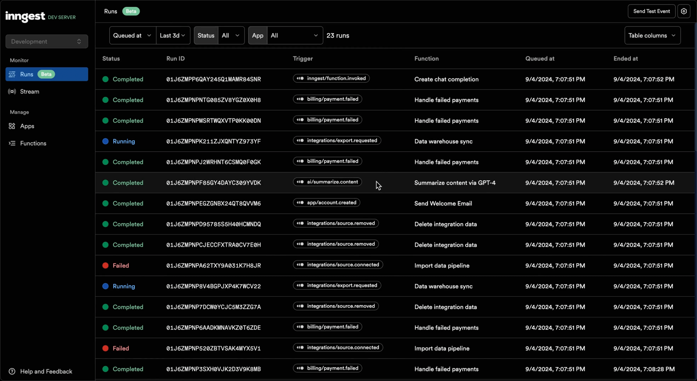
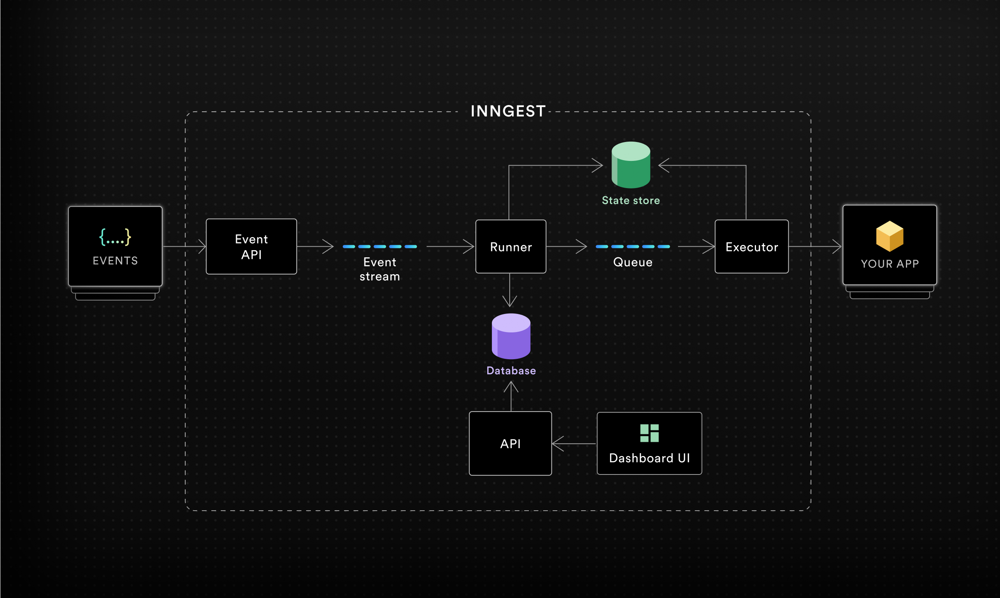

# [](https://www.inngest.com)

[](https://github.com/inngest/inngest/releases)
[](https://github.com/inngest/inngest/actions?query=branch%3Amain)
[](https://www.inngest.com/discord)
[](https://twitter.com/inngest)

[Inngest](https://www.inngest.com/?ref=github-inngest-readme)'s durable functions replace queues, state management, and scheduling to enable any developer to write reliable step functions faster without touching infrastructure.

1. Write durable functions using any of [**our language SDKs**](#sdks)
2. Run the [**Inngest Dev Server**](#getting-started) for a complete local development experience, with production parity.
3. Deploy your functions to your own infrastructure
4. Sync your application's functions with the [**Inngest Platform**](https://www.inngest.com/?ref=github-inngest-readme) or a [self-hosted Inngest server](#self-hosting).
5. Inngest invokes your functions securely via HTTPS whenever triggering events are received.

### An example durable function

Inngest Functions enable developers to run reliable background logic, from background jobs to complex workflows. An Inngest Function is composed of three key parts that provide robust support for retrying, scheduling, and coordinating complex sequences of operations:

- [**Triggers**](https://www.inngest.com/docs/features/events-triggers?ref=github-inngest-readme) - Events, Cron schedules or webhook events that trigger the function.
- [**Flow Control**](https://www.inngest.com/docs/guides/flow-control?ref=github-inngest-readme) - Configure how the function runs are enqueued and executed including concurrency, throttling, debouncing, rate limiting, and prioritization.
- [**Steps**](/docs/features/inngest-functions/steps-workflows?ref=github-inngest-readme) - Steps are fundamental building blocks of Inngest, turning your Inngest Functions into reliable workflows that can runs for months and recover from failures.

Here is an example function that limits concurrency for each unique user id and performs two steps that will be retried on error:

```typescript
export default inngest.createFunction(
  {
    id: "import-product-images",
    concurrency: {
      key: "event.data.userId",
      limit: 10
    }
  },
  { event: "shop/product.imported" },
  async ({ event, step }) => {
    // Here goes the business logic
    // By wrapping code in steps, each will be retried automatically on failure
    const s3Urls = await step.run("copy-images-to-s3", async () => {
      return copyAllImagesToS3(event.data.imageURLs);
    });
    // You can include numerous steps in your function
    await step.run("resize-images", async () => {
      await resizer.bulk({ urls: s3Urls, quality: 0.9, maxWidth: 1024 });
    })
  };
);

// Elsewhere in your code (e.g. in your API endpoint):
await inngest.send({
  name: "shop/product.imported",
  data: {
    userId: "01J8G44701QYGE0DH65PZM8DPM",
    imageURLs: [
      "https://useruploads.acme.com/q2345678/1094.jpg",
      "https://useruploads.acme.com/q2345678/1095.jpg"
    ],
  },
});
```

## Learn more

- [Getting started](#getting-started)
- [SDKs](#sdks)
- [Project Architecture](#project-architecture)
- [Self-hosting](#self-hosting)
- [Community](#community)

## Getting started

Run the Inngest Dev Server using our CLI:

```
npx inngest-cli@latest dev
```

Open the Inngest Dev Server dashboard at http://localhost:8288:



Follow our [Next.js](https://www.inngest.com/docs/getting-started/nextjs-quick-start?ref=github-inngest-readme), [Node.js](https://www.inngest.com/docs/getting-started/nodejs-quick-start?ref=github-inngest-readme) or [Python](https://www.inngest.com/docs/getting-started/python-quick-start?ref=github-inngest-readme) quick start guides.

## SDKs

- **TypeScript / JavaScript** ([inngest-js](https://github.com/inngest/inngest-js)) - [Reference](https://www.inngest.com/docs/reference/typescript?ref=github-inngest-readme)
- **Python** ([inngest-py](https://github.com/inngest/inngest-py)) - [Reference](https://www.inngest.com/docs/reference/python?ref=github-inngest-readme)
- **Go** ([inngestgo](https://github.com/inngest/inngestgo)) - [Reference](https://pkg.go.dev/github.com/inngest/inngestgo)
- **Kotlin / Java** ([inngest-kt](https://github.com/inngest/inngest-kt))

## Project Architecture

To understand how self-hosting works, it's valuable to understand the architecture and system components at a high level. We'll take a look at a simplified architecture diagram and walk through the system.

<br />

<p align="center">
  
</p>

- **Event API** - Receives events from SDKs via HTTP requests. Authenticates client requests via [Event Keys](https://www.inngest.com/docs/events/creating-an-event-key?ref=github-inngest-readme). The Event API publishes event payloads to an internal event stream.
- **Event stream** - Acts as buffer between the _Event API_ and the _Runner_.
- **Runner** - Consumes incoming events and performs several actions:
  - Scheduling of new “function runs” (aka jobs) given the event type, creating initial run state in the _State store_ database. Runs are added to queues given the function's flow control configuration.
  - Resume functions paused via [`waitForEvent`](https://www.inngest.com/docs/features/inngest-functions/steps-workflows/wait-for-event?ref=github-inngest-readme) with matching expressions.
  - Cancels running functions with matching [`cancelOn`](https://www.inngest.com/docs/features/inngest-functions/cancellation/cancel-on-events?ref=github-inngest-readme) expressions
  - Writes ingested events to a database for historical record and future replay.
- **Queue** - A multi-tenant aware, multi-tier queue designed for fairness and various [flow control](https://www.inngest.com/docs/guides/flow-control?ref=github-inngest-readme) methods (concurrency, throttling, prioritization, debouncing, rate limiting) and [batching](https://www.inngest.com/docs/guides/batching?ref=github-inngest-readme).
- **Executor** - Responsible for executing functions, from initial execution, step execution, writing incremental function run state to the _State store_, and retries after failures.
- **State store (database)** - Persists data for pending and ongoing function runs. Data includes initial triggering event(s), step output and step errors.
- **Database** - Persists system data and history including Apps, Functions, Events, Function run results.
- **API** - GraphQL and REST APIs for programmatic access and management of system resources.
- **Dashboard UI** - The UI to manage apps, functions and view function run history.

<br />

## Community

- [**Join our Discord community for support, to give us feedback, or chat with us**](https://www.inngest.com/discord).
- [Post a question or idea to our GitHub discussion board](https://github.com/orgs/inngest/discussions)
- [Read the documentation](https://www.inngest.com/docs?ref=github-inngest-readme)
- [Explore our public roadmap](http://roadmap.inngest.com/)
- [Follow us on Twitter](https://twitter.com/inngest)
- [Join our mailing list](https://www.inngest.com/mailing-list) for release notes and project updates

## Contributing

We embrace contributions in many forms, including documentation, typos, bug reports or fixes. Check out our [contributing guide](/docs/CONTRIBUTING.md) to get started. Each of our open source [SDKs](#sdks) are open to contributions as well.

Additionally, Inngest's website documentation is available for contribution in [the `inngest/website` repo](https://github.com/inngest/website).

## Self-hosting

Self-hosting the Inngest server is possible and easy to get started with. Learn more about self-hosting Inngest in [our docs guide](https://www.inngest.com/docs/self-hosting?ref=github-inngest-readme).

## License

The Inngest server and CLI are available under the Server Side Public License and delayed open source publication (DOSP) under Apache 2.0. [View the license here](/LICENSE.md).

All Inngest [SDKs](#sdks) are all available under the Apache 2.0 license.
