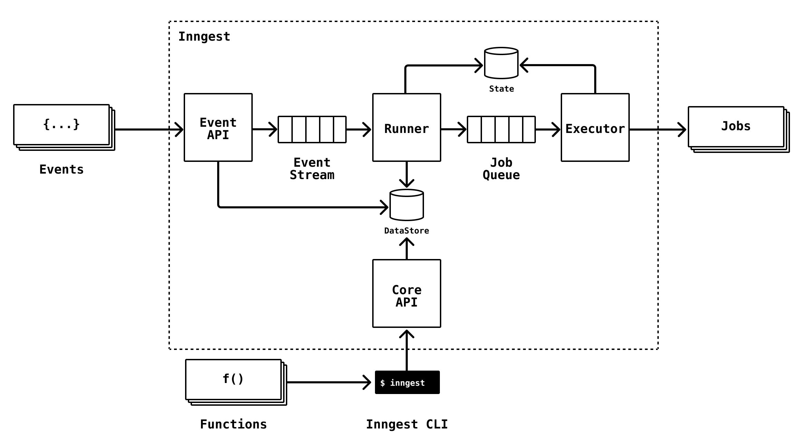

# DevServer Architecture

  

After reviewing all of [the components in the README here](../README.md), you may start to understand already how the system works together. For the dev server, the basic overall idea for how the system works is as follows:

1. The **DevServer** is the main component that orchestrates all of the components while running in the simplified development mode. To start, the dev server loads functions.
2. **Loading functions** - The **DevServer** loads functions from disk and registers the function triggers in an in-memory lookup table. This is the development version of the **DataStore** service.
   1. Function configurations are parsed to organize all steps (1:n) into a DAG. Each step’s configuration is passed to the in-memory **DataStore**. Steps have a reference to the particular _Action_ version that is to be executed. You can think of Steps as the configuration and Actions as the actual code to be run.
3. **Preparing and Building actions** - The **DevServer** iterates through each action and prepares each for it’s given runtime. In the case of the Docker runtime, container images are built in parallel.
4. Separately, the DevServer starts the **Event API** and can start receiving events via HTTP POST request with a JSON body in [the standard event structure](https://www.inngest.com/docs/event-format-and-structure).
5. As events are received by the **Event API**, the **DevServer**’s handler determines what functions to execute based on its map of event triggers and functions. It then passes the event and the function to the **Executor** via the runner.
   1. The **DevServer** uses an in-memory runner to queue jobs for the **Executor**. The runner generates a unique run id for every job which is stored in the **State** store, which in the dev server is in-memory.
6. The **Executor** begins executing actions, traversing the DAG that was previously generated from the function’s config. As actions are completed, the successful output or error is saved to the **State** store. Each action’s saved output is passed to each child action in the DAG as it is traversed and executed by the **Executor**.

## Differences to production

There are several differences to the production version of Inngest as compared to the DevServer. The aim of this project is to create abstractions around every difference and add driver support (see below) so this project can be run in a production or test environment if you desire it. This is a non-exhaustive list of differences from the above on how Inngest runs differently in production.

_In production…_

- The **Event API** has a source registry which stores all valid source API keys for securely sending data for a particular account.
- The **DevServer**’s in-memory map of event triggers to functions is stored using the **DataStore** component.
- There is a **Core API** which enables the Inngest CLI to manage the system, including deploying functions.
- There is a **PubSub** component that is the layer in between the **Event API** and the runner. For local development, this isn’t a necessary point to decouple, but in production it’s needed for reliability and scale.
- **Actions** are not built by any part of the system, they are built with the **Inngest CLI** when functions are deployed via `inngest deploy`. Action container images pushed to Inngest’s own secure container registry and action version metadata is stored in a database via Inngest’s GraphQL API. For local development, the DevServer does this on-demand and keeps container images in memory for fast, lightweight development.
- The **State** store is a highly scalable database that can store millions of events from the Executor.
- The **Executor** runs Docker jobs in a secure Nomad cluster, capturing the output or errors using a custom driver which then pushes data into the **State** store.

## Driver support

In-memory solutions are great for local development, but as detailed in the _Differences to production_ section, they are never suitable for real deployments of Inngest. A major goal of this project is to bring driver support to the various components of the architecture, enabling developers to run the system themselves using backing infrastructure of their choosing. Some early plans that we aim to release as part of [our roadmap](https://github.com/orgs/inngest/projects/1) are:

- PostgreSQL driver for persistence of function and action version metadata ([source code](/pkg/coredata/postgres))
- Redis State store for the Executor ([source code](/pkg/execution/state/redis_state))
- AWS SQS implementation for the Event Stream & Executor's Job Queue ([source code](/pkg/execution/queue/sqsqueue))
- Google PubSub driver for decoupling the API and the execution layer
- AWS Lambda runtime driver for executing jobs in an environment other than Docker.

---

_Have an idea for a driver to build? Want to contribute or collaborate with us on a driver? [Join our Discord and drop us a line!](https://www.inngest.com/discord)_
