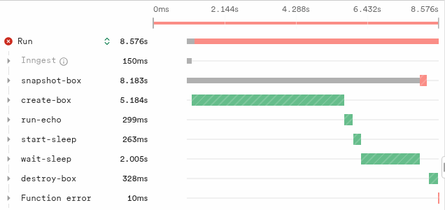
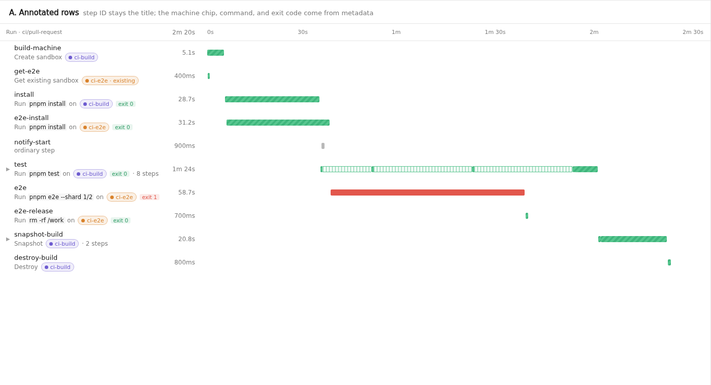
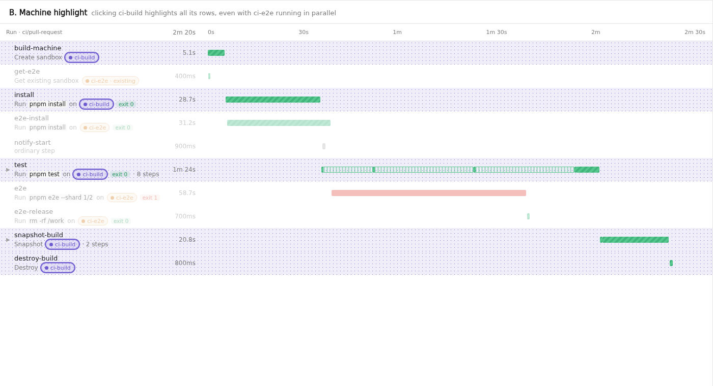
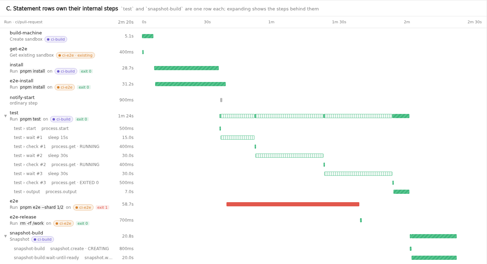
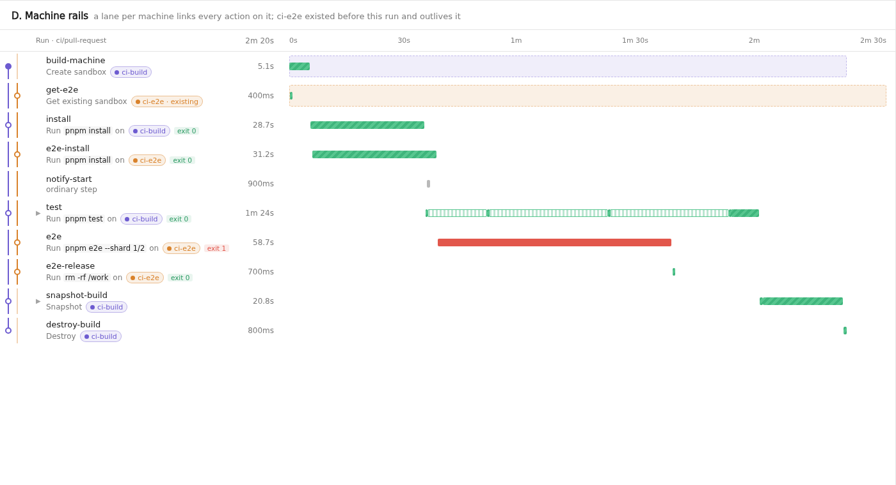
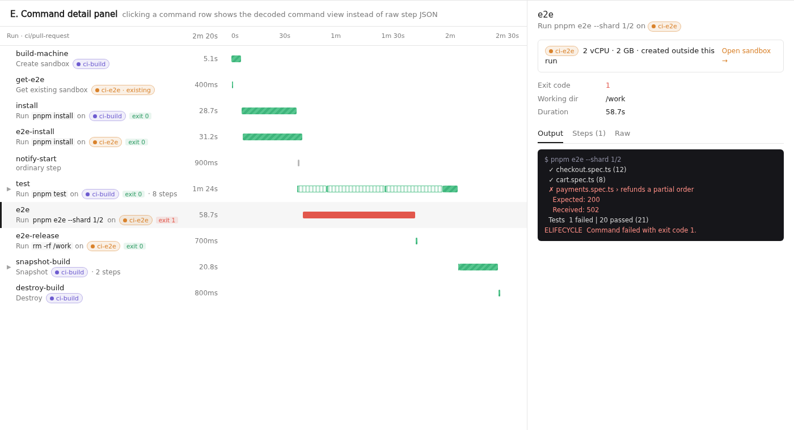

# Readable sandbox traces

Status: data slice implemented, UI proposed. Branch `jack/sandbox-traces` in
`inngest` and `inngest-js`.

## Problem

`step.sandbox` is built on ordinary `step.run` calls, so a run's trace shows
each sandbox action as an anonymous step. Nothing says which rows are sandbox
work, which machine a command ran on, what command it was, or whether it
passed. Output is raw wire JSON with base64 stdout. Some calls take more than
one step (`snapshot()` is a create plus a readiness wait; the CI layer's long
commands are a start, sleeps, polls, and an output fetch), and those appear as
unrelated rows.

This is the same run today (`create`, `commands.run`, `processes.start`,
`process.wait`, `snapshot`, `destroy`):



## Rules for the UI

Agreed with the user:

1. **One row per statement the user wrote**, titled with the user's step ID,
   "just like always". A generated description is secondary text.
2. **A row includes everything done to serve it.** Internal steps (a snapshot's
   readiness wait; CI polling, sleeping and output fetches) belong to their
   statement's row, not to rows of their own.
3. **Rows are linked to their machine.** Creating a machine is a row, and every
   later command, snapshot, and destroy on that machine is visibly tied to it.
4. **Chronological order is kept**, so parallel work still reads as parallel.
   Linking is by colour chip plus highlight, not by reparenting rows.

## Data contract: `inngest.sandbox` step metadata

Every step behind `step.sandbox` now carries one step-scoped metadata entry of
kind `inngest.sandbox`. UIs and APIs should rely on this data only, never on
step IDs or the step input shape.

| Field | Type | Meaning |
|---|---|---|
| `version` | `1` | Shape version. |
| `action` | string | Sandbox API operation this step performed: `create`, `exec`, `process.start`, `process.wait`, `snapshot.create`, `snapshot.waitUntilReady`, `destroy`, ... `sleep` is an internal `step.sleep` waiting on behalf of a statement (a CI command's pause between polls). |
| `statement` | string | SDK method the user called: `create`, `commands.run`, `processes.start`, `process.wait`, `snapshot`, `snapshot.clone`, `destroy`, ... Internal steps carry their statement's method. |
| `statement_id` | string | Hashed step ID (the trace's `stepID`, and `run_metadata.step_id`) of the statement step this step belongs to. Never the user's step ID. Equal to the step's own ID for a statement step. **This is the grouping key for rule 2.** |
| `role` | `statement` \| `internal` | Whether this step is the row the user wrote, or work serving another row. |
| `statement_name` | string | The user's label for the statement (a CI command's name). Set on internal steps when the statement has no step of its own, so the row still has a title. |
| `sandbox_id`, `sandbox_name` | string | The machine this step acted on or created. **This is the linking key for rule 3.** Taken from the reference the operation targets, so it's present before any result and on failure. A failed `create` has only the name. See [Machines from outside the run](#machines-from-outside-the-run). |
| `source_snapshot_id` | string | For `create`/`snapshot.clone`, the snapshot the machine was cloned from. Links a clone to the `snapshot` row that made it. |
| `command` | string[] | Argv of a command or process (cut to 1 KiB total). |
| `command_display` | string | The shell string the user wrote, when they passed one (`commands.run("npm test")`). |
| `command_truncated` | bool | `command`/`command_display` were cut. |
| `cwd` | string | Working directory, when given. |
| `process_id`, `process_state` | string | For process actions. |
| `exit_code` | int | For `exec` and finished processes. `0` is sent explicitly. |
| `termination_signal` | int | For killed processes. |
| `output_truncated` | bool | Captured stdout/stderr was tail-truncated to fit the step output. |
| `snapshot_id`, `snapshot_status` | string | For snapshot actions. |
| `error_code` | string | The sandbox API's error code when the step failed, like `sandbox_snapshot_limit_exceeded`. |

Two rules keep the entries safe to store and fold:

- **One whole entry per step attempt.** Entries for the same span and kind are
  folded as merge patches, which never clear a key that a later entry omits.
  So each attempt sends exactly one entry with its full value set, and never
  a partial update that relies on an earlier one. A retry that succeeds
  carries no `error_code`, because it's a separate attempt span with its own
  entry (`trace.test.ts` covers this).
- **Flat values.** Only scalars and short string arrays (`command`), no nested
  objects, so values round-trip through ClickHouse `JSON` and DuckDB `VARIANT`
  (`sandbox_test.go` checks this).

Where it comes from:

- **SDK** (`inngest-js`, `packages/inngest/src/components/sandbox/`): the
  durable facade passes a trace context (`statement`, and for internal steps the
  statement's operation and machine) to the middleware's raw tool. The step
  handler attaches the metadata with `addMetadata` after the operation
  succeeds or fails (`trace.ts`, `middleware.ts`). An internal step resolves its
  statement's step ID via the middleware's `transformStepInput` hook, which sees
  the hashed ID every sandbox operation was planned or memoized under.
- **Server** (`inngest`, `pkg/tracing/metadata/sandbox.go`): `SandboxMetadata`
  and `KindInngestSandbox`, allowlisted in `kind.go`, with generated UI types
  in `ui/packages/components/src/generated/index.ts`. A server without the
  allowlist entry drops the entry with a warning; the step itself is
  unaffected.
- **GraphQL**: nothing new. It's `RunTraceSpan.metadata` like every other kind.

A real run on the dev server (abridged):

```text
create-box    stepID=8b9fffaa…  {"action":"create","statement":"create","role":"statement",
                                 "statement_id":"8b9fffaa…","sandbox_id":"619d7d90-…","sandbox_name":"n1-trace-box"}
run-echo      stepID=4f533549…  {"action":"exec","statement":"commands.run","role":"statement",
                                 "statement_id":"4f533549…","sandbox_id":"619d7d90-…",
                                 "command":["/bin/sh","-c","echo hello && uname -a"],
                                 "command_display":"echo hello && uname -a","exit_code":0}
start-sleep   stepID=a2521871…  {"action":"process.start","statement":"processes.start",
                                 "process_id":"af3c939a-…","process_state":"RUNNING",…}
wait-sleep    stepID=d797daa2…  {"action":"process.wait","statement":"process.wait",
                                 "process_id":"af3c939a-…","process_state":"EXITED","exit_code":0,…}
snapshot-box  stepID=654cdefe…  {"action":"snapshot.create","statement":"snapshot",
                                 "error_code":"sandbox_snapshot_limit_exceeded",…}   (FAILED)
destroy-box   stepID=cb91cfd7…  {"action":"destroy","statement":"destroy","sandbox_id":"619d7d90-…",…}
```

A successful `snapshot()` adds a second step, `snapshot-box:wait-until-ready`,
with `role: "internal"` and `statement_id` pointing at `snapshot-box` (covered
by `trace.test.ts`; the account's snapshot quota blocked it in the real run).

## Machines from outside the run

Sandboxes can be created and managed entirely outside Inngest functions: with
the direct `inngest.sandboxes` client, by another run, or by another service. A
run's trace may hold only part of a machine's life. For example, it may run
commands on a machine it got with `step.sandbox.get`, or create a machine it
never destroys.

So:

- **The machine's identity is `sandbox_id`**, never a create row. Chips,
  colours, highlights and rails are keyed by `sandbox_id` alone, and
  `sandbox_name` is only a label. A create row, when there is one, is just
  another row on that machine.
- **Identity doesn't depend on a result.** Every operation that targets a
  machine carries its reference (`get` carries the ID it asked for), and the
  metadata reads the ID and name from there. A command that fails, or a `get`
  that finds nothing, still names its machine. The only exception is a failed
  `create`, which has no ID yet and is identified by `sandbox_name`. An
  executor that emits this metadata before running an operation (see F4 below)
  has the same information available.
- **"Created outside this run" is derived, not sent.** If no row in the run
  has `action` `create` for a `sandbox_id`, the UI can mark the machine's first
  row "existing machine" and render the rail (option D) as entering from above
  the first row. Likewise, a machine with no `destroy` row can be drawn as still
  alive at the end. The SDK can't know where a machine came from, but the
  trace can tell whether it was created here.
- **Snapshots are their own resource.** A standalone `snapshots.get`,
  `snapshot.delete` or `snapshot.waitUntilReady` names its `snapshot_id`, not a
  machine, because a snapshot ref doesn't record its source machine. A
  `snapshot()` call's internal wait does carry the machine, from its
  statement.

### Cross-run views, later

In Cloud, step metadata is also dual-written to a run metadata table (see
`createMetadataSpanOnParent` in `pkg/execution/executor/executor.go`), so the
same fields could answer questions across runs:

- "every run that touched sandbox X": filter by `kind = inngest.sandbox` and
  `sandbox_id`. This would give the Sandboxes page a "Runs" tab, and let a
  trace's machine chip link to the machine's history.
- "which run made this snapshot" (`snapshot_id` with `action`
  `snapshot.create`), and "which snapshot this machine came from"
  (`source_snapshot_id`).

These need an index or materialised column on `sandbox_id`, since it lives in
metadata values today. No data change is needed.

## UI options

All mocks below use one scenario: a CI-like run with two machines in parallel.
`ci-build` is created and destroyed by the run. `ci-e2e` is an existing
machine the run picks up with `step.sandbox.get` and leaves running, so its
create and destroy happen outside this run. There's also an unrelated
`step.run` in the middle, a long `test` command made of several internal
steps, and a snapshot. They're static HTML
(`mocks.html`) rendered with headless Chromium; every value shown comes from
the metadata above plus span timing. The options compose: A is the baseline,
and B–E add to it.

### A. Annotated rows

The step ID stays the title. Under it: a description built from `statement`,
`command_display`/`command` and `sandbox_name`, a machine chip coloured from
`sandbox_id`, and an exit-code badge from `exit_code`. Rows with internal steps
say how many. A machine with no `create` row in the run is marked "existing"
on its first row. Cheapest option; no interaction.



### B. Machine highlight

Selecting a machine gives every row with that `sandbox_id` the
experiment-style dotted background (in the machine's colour) and dims the rest.
Works across parallel work because it's a per-row flag, exactly like
`hasExperiment` in `RunDetailsV4/TimelineBar.tsx`.

Decided interaction: **clicking a machine chip pins the highlight** (click it
again, or press Escape, to clear), and **hovering a chip previews it** while no
machine is pinned. The mock shows `ci-build` pinned.



### C. Statement rows own their internal steps

Steps sharing a `statement_id` render as one row, titled by the `role:
"statement"` step, with a bar that's the union of its steps (waits drawn
hollow). Expanding shows the internal steps as sub-rows. This is what makes a
CI command "one row per statement" instead of a start, N sleeps, N polls, and
an output fetch.



### D. Machine rails

A narrow gutter gives each machine a lane, like a git graph: a filled node on
the row that created it, a hollow node on every row that used it, and a line
until its last use. A machine created outside the run enters from above (faint
line, no filled node), and one that isn't destroyed runs off the bottom. A faint
band on the timeline shows the machine's lifetime within the run.
Makes "which machine" readable at a glance without hovering, at the cost of
horizontal space when many machines overlap.



### E. Command detail panel

Selecting a sandbox row replaces the raw step output with a purpose-built view:
the command, exit code, working directory, a terminal-style stdout/stderr
(decoded from the step output), the machine card with a link to the Sandboxes
page, and the internal steps behind the row.



### Recommendation

Ship **A + B + C** first: they satisfy all four rules with modest UI work in
`ui/packages/components/src/RunDetailsV4` (shared by the dev server and the
dashboard). Add **E** next, since raw base64 output is the other big pain
point. Treat **D** as an experiment once people run pipelines with many
machines.

## Where the UI work lives

- `utils/traceConversion.ts`: read `inngest.sandbox` in `traceToBarData`, like
  `hasExperiment`. Group sibling spans by `statement_id` into one bar (C).
- `TimelineBar.tsx`: secondary text, machine chip, exit badge (A); the
  highlight background keyed by a selected `sandbox_id` (B), generalising the
  existing experiment background.
- `StepInfo.tsx`: a sandbox tab or panel (E).

Runs without the metadata (older SDKs, other languages) render exactly as
today.

### DuckDB and flat spans

Riley's DuckDB work replaces dynamic spans with flat spans and stores metadata
in a `run_metadata` table, keyed by run, parent span, kind and step
(`step_id` is the hashed step ID). See the spec,
[DuckDB Cloud Dual-Write with CH Buffer](https://app.notion.com/p/inngest/DuckDB-Cloud-Dual-Write-with-CH-Buffer-3e4b64753bbd806ab2e7db88e7d5d0c0),
[#4879](https://github.com/inngest/inngest/pull/4879) (merged; routes every
metadata span, including SDK `addMetadata`, to `OnMetadataEntry`) and
[#4880](https://github.com/inngest/inngest/pull/4880) (DuckDB dual-write and
the flat trace loader).

This design already fits:

- The UI depends only on `RunTraceSpan.metadata` entries of kind
  `inngest.sandbox`. Grouping by `statement_id` and linking by `sandbox_id`
  happen in `traceConversion.ts`, not in the Go trace loader, so nothing relies
  on the dynamic-span rollups the flat model removes.
- `inngest.sandbox` entries reach `run_metadata` with no extra work, and
  `sandbox_id` is queryable in Insights from `values`.

What it needs from that work: the flat loader
(`pkg/coreapi/graph/loaders/trace_flat.go`) doesn't fill
`RunTraceSpan.metadata` yet ("no metadata-span rollup"). It must, from
`run_metadata`, for every kind. Experiments need the same thing.

## CI layer (`inngest/ci`, branch `jack/ci`)

Not done in this slice. CI builds each command from several `step.sandbox`
calls (`processes.start`, `processes.get` polls, `getOutput`) plus its own
`step.sleep`s. To make those one row:

1. Add an internal "sandbox statement" scope in async local storage, holding the
   statement's step ID and machine. CI opens it around a command. Inside it, the
   sandbox middleware marks every `step.sandbox` step `role: "internal"` with
   that `statement_id`. The public facade needs no new options.
2. Tag the sleeps. A sleep never runs a handler, so it can't `addMetadata` from
   inside the step. Instead, copy the same scope onto `op.opts` (as
   `group.experiment` does with `experimentContext`), and have the executor
   turn it into an `inngest.sandbox` entry (as `ExtractExperimentOptsMetadata`
   does).

## If sandbox operations become executor opcodes (F4)

The contract doesn't change: the executor would emit `SandboxMetadata` itself
when it runs the opcode, using the struct already in `sandbox.go`. The UI is
unaffected.

What becomes throwaway: the SDK's `addMetadata` call and trace context
(`trace.ts`, about 300 lines, plus the `transformStepInput` hook). If one
opcode covers a whole statement (for example a command including its waiting),
there are no internal steps and `statement_id` is always the step's own ID; the
grouping in option C then simply never triggers for those rows. Nothing in the
UI needs to be undone.

## Rollout to Cloud

Cloud (`inngest/monorepo`) doesn't have its own metadata allowlist. It imports
this repo as a Go module and vendors it: `go.mod` requires
`github.com/inngest/inngest` at a pseudo-version (on `develop` on 2026-09-30:
`v1.45.2-0.20260929202128-3c3c7666fd48`, i.e. inngest `3c3c7666`), and
`vendor/github.com/inngest/inngest/pkg/tracing/metadata/kind.go` is the
allowlist Cloud enforces. Its executor is the vendored
`pkg/execution/executor` too.

Bumps are automated:

1. Merge the inngest PR to `main`. `.github/workflows/dispatch_upstream.yml`
   fires a `repository_dispatch` (`upstream-inngest`) at `inngest/monorepo`.
2. The monorepo's `.github/workflows/upstream-inngest.yml` runs
   `go get github.com/inngest/inngest@<new main sha>` and `make mod` (`GOWORK=off
   go mod tidy && go mod vendor`) on the `automated/upstream-inngest` branch,
   and opens or updates a PR titled `chore(deps): upstream inngest/inngest@main
   (N commits behind)` against `develop`.
3. A human reviews and merges that PR (#8937 on 2026-09-29 merged two
   minutes after it opened). Cloud's normal deploy from `develop` then picks it
   up. I haven't checked the deploy pipeline itself.

So the steps for this change are:

1. Merge the inngest PR (allowlist + `SandboxMetadata`).
2. Merge the next automated upstream PR in `inngest/monorepo`, checking that
   `vendor/github.com/inngest/inngest/pkg/tracing/metadata/sandbox.go` and the
   `kind.go` allowlist line are in its diff.
3. Only then release the SDK change. Releasing earlier is harmless: Cloud
   logs `invalid metadata in checkpoint step` and drops the entry, and the step
   is unaffected.
4. The trace UI changes (in this repo's `ui/`) can ship any time after step 2.
   Runs from before then render as they do today.

To test Cloud against an unmerged inngest branch, the monorepo has `make
oss-vendor OSSHASH=<sha>` (`go get github.com/inngest/inngest@<sha>` plus
`make mod`) for a monorepo branch.

## Open questions

1. **Secrets in commands.** Command argv, `environment` values and stdout are
   already stored in plain text in step input and output (see the separate
   secrets audit). This metadata copies up to 1 KiB of argv, which adds another
   place to look but no new category of data. Fix the underlying exposure
   before the UI makes commands more prominent.
2. **Flat loader metadata (for Riley).** Will the flat/DuckDB trace loader
   fill `RunTraceSpan.metadata` from `run_metadata`, generically for every
   kind, and when?
3. **Hashed or userland `step_id` (for Riley).** #4879's
   `MetadataEntry.StepID` prefers the userland ID, while the `run_metadata`
   migration comment says `step_id` is hashed. Which is it? `statement_id` is
   pinned to the hashed ID either way.
4. **Fold key (for Riley).** Will metadata keep folding per span and kind, or
   move to per step across attempts? Per step, a failed attempt's
   `error_code` would leak into a later successful attempt.
5. **Indexing (for Riley).** Will `inngest.*` kinds get per-kind indexes or
   promoted columns (for example `sandbox_id`), or is `VARIANT` shredding
   enough for cross-run lookups?
