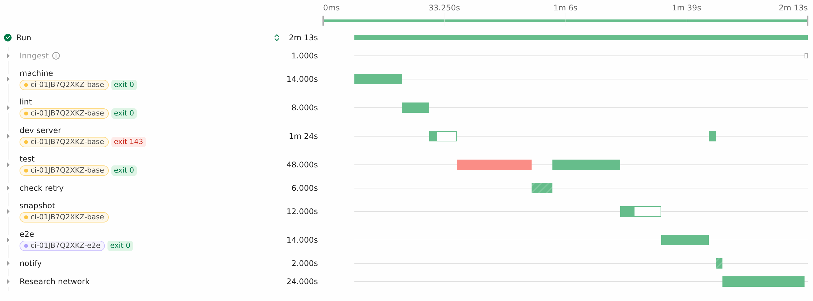
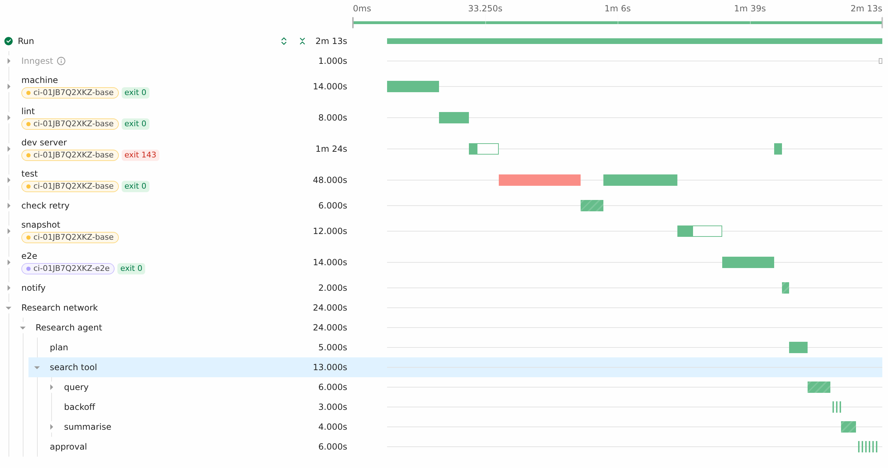
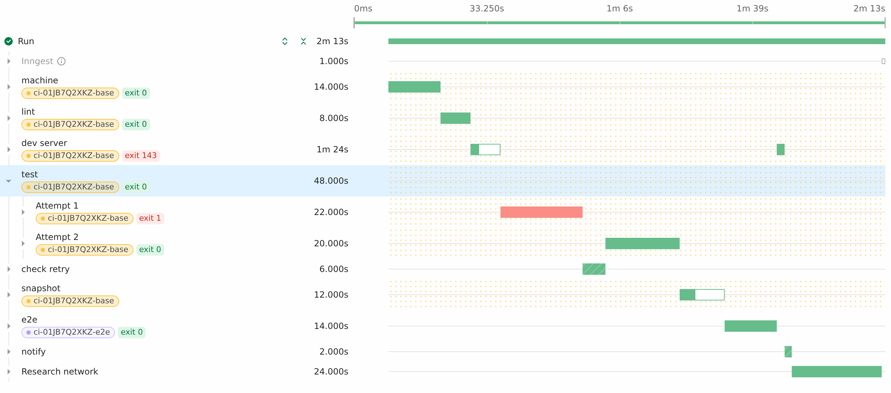

# Step spans

Step spans (span groups) say "these steps belong together", to any depth, so a
trace shows one row per thing the code did: a CI command, a sandbox machine, an
agent, a tool call. The SDK tags each step with its group path, the API nests
the steps, and the UI renders the tree it's given.

## Contract

**SDK.** Every opcode called inside a group carries the full group path,
outermost first, in `opts.span`. Steps outside any group have no `span` key.

```json
"opts": { "span": [{ "id": "agent", "name": "Research agent" }, { "id": "search", "name": "search tool" }] }
```

The same path is the same group: opening a group with an ID its parent has
already used re-enters it (a background process's later calls, for example).
Distinct groups need distinct IDs, chosen by the caller.

**Executor.** `generatorAttrs` copies the path onto the step span as
`_inngest.step.span_path`, a JSON array of `{id, name}`
(`GeneratorOpcode.SpanPath()`, `meta.Attrs.StepSpanPath`). It runs for every
opcode type and on both checkpoint paths, so sleeps and waits are grouped too.

**API.** The trace loader (`pkg/coreapi/graph/loaders/span_groups.go`) makes
one pass over the run span's direct children. Execution spans may carry the
attribute too and are ignored; a step whose path is only on its execution
inherits it like its step ID. Each step with a path is placed under virtual
spans, one per path prefix:

| Field | Value |
| --- | --- |
| `spanID` | `span:` + 16 hex chars of a SHA-256 over the path's IDs |
| `name` | the last path element's name |
| `stepType` | `SPAN_GROUP` (`stepOp`, `stepID`, `outputID` are null) |
| `queuedAt`, `startedAt` | the earliest of its children's |
| `endedAt` | the latest of its children's, or null while any child is running |
| `status` | `RUNNING` while any child is, otherwise the status of the child that ended last |
| `duration` | `endedAt - startedAt` once ended |
| children | steps and subgroups, sorted by `queuedAt` |

A top-level group takes the place of its first step among the run's children.
Single-child groups are not collapsed. A retried step's attempts are separate
run-level spans and land in the same group. Runs without span paths are
unchanged.

GraphQL, the REST v2 trace, the CLI and MCP share this converter. The REST
`TraceSpan` has a `stepType` field (`step_type` in the proto), `SPAN_GROUP`
for groups.

**Rerun.** Rerunning a group reruns from its earliest-queued step: the UI sends
that step's `stepID`. Group span IDs are virtual and never sent.

## UI

- `traceRollup` keeps `SPAN_GROUP` spans and rolls up retried steps inside
  them, recursively, the same way as at the root.
- A group row has its own style (`span.group`), so it gets no timing
  breakdown or "Your server" child. It is collapsed by default.
- Collapsed, the group's bar draws each direct child as a segment over its own
  time range: sleeps and waits (`waitForEvent`, `waitForSignal`) hollow,
  everything else (runs, AI, invokes, subgroups) solid, coloured by status.
  Expanded, its own bar hides like any expanded parent.
- The hover lists the direct children and their durations.
- The step panel for a group offers "Rerun from start of span".

**Sandbox chips** (`RunDetailsV4/SandboxAnnotation.tsx`, kept separate so they
are easy to drop). Steps with `inngest.sandbox` metadata show the command, a
machine chip (coloured by first appearance in the run, middle-truncated with
the full name in its tooltip) and an exit badge. A group shows the chip when
its sandbox steps share one `sandbox_id` (steps that name no machine don't
count), and the exit code of its last step that has one. Clicking a chip pins a
dotted highlight on every row of that machine, hovering previews it, and Escape
clears it.

`inngest.sandbox` values: `version`, `action`, `method` (the SDK method the
user called, like `commands.run`), and the optional flat fields `sandbox_id`,
`sandbox_name`, `source_snapshot_id`, `command`, `command_display`,
`command_truncated`, `cwd`, `process_id`, `process_state`, `exit_code`,
`termination_signal`, `output_truncated`, `snapshot_id`, `snapshot_status`,
`error_code`.

## Limits and follow-ups

- **Query depth.** The dev server and dashboard trace queries fetch 8 levels
  of `childrenSpans`: run → group → group → group → step → attempt → userland
  → userland. Deeper nesting is cut off. Returning spans as a flat list with
  parent IDs would remove the cap.
- **Flat loader.** The cloud's flat-span loader (`convertFlatSpanToGQL`) needs
  the same post-pass, and planned steps there get no path until they finish,
  because `OnStepScheduled` receives no opcode.
- **Attempt rollup** still happens in the browser; moving it to the loader
  would give every API consumer the same tree.
- `defer()` opcodes are built outside the SDK's step wrapper, so defers are
  not grouped.

## Screenshots

From the hand-built fixture
(`ui/packages/components/src/RunDetailsV4/utils/stepSpans.fixture.ts`):

- Collapsed groups: 
- A nested agent group expanded: 
- A machine pinned: 
