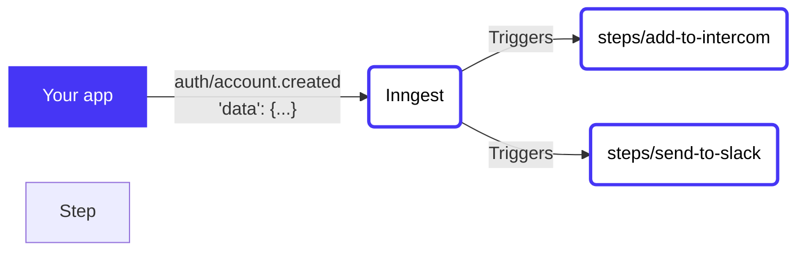

# Account federation

This function responds to an `auth/account.created` event sent when a new user signs up, then adds
the user to several external systems and sends a message in slack - in real-time.


<!-- https://mermaid.live/ is a great tool for this, and docs are at https://mermaid-js.github.io/mermaid/#/flowchart -->


1. When a user registers an account, the `auth/account.created` event is sent to Inngest
2. Inngest runs each of the steps in parallel, adding the user to all external services.

## Contents

- [Why](#why)
- [Usage](#usage)
- [Code](#code)
- [Configuration](#configuration)


## Why

Using step functions to add users to external systems (user federation) provides a few benefits:

1. It happens in real time, vs relying on standard ETL processes.  This means fewer issues for your users and team.
2. If external APIs have errors we'll retry steps individually
3. Functions are versioned and easily changed, so modifying this flow with future changes is simple
4. It's decoupled from the sign-up flow, removing any risk of introducing sign-up bugs

## Usage

<!-- A quick view of how to get started with the template. -->
<!-- The CLI can guide them -->
Use this quickstart with a single CLI command to get started! The CLI will then guide you through running, testing, and deploying to [Inngest Cloud](https//inngest.com/sign-up?ref=github-example).

Via the CLI:

```sh
inngest-cli init --template github.com/inngest/inngest#examples/account-federation
```

Via NPX:
```sh
npx inngest-cli init --template github.com/inngest/inngest#examples/account-federation
```

With the function cloned, run `inngest run` to test the function locally.

## Code

This function has several steps within `steps/`.  Each step runs in parallel independently of each
other.

In this example, all steps are Typescript functions which implement 3rd party APIs for creating
users in external systems.  You can use any language in steps and integrate any APIs you need.

## Configuration

Below is the annotated function definition (found at [inngest.json](/inngest.json)) to show how the above is defined in config.

```json
{
  "$schema": "https://raw.githubusercontent.com/inngest/inngest/ad725bb6ca2b3846d412beb6ea8046e27a233154/schema.json",
  "name": "Add new users to external systems",
  "description": "Run a step function to add newly created users to all external systems at once",
  "tags": ["typescript", "auth", "step function"],
  "id": "gentle-katydid-de85f5",
  "triggers": [
    {
      "event": "auth/account.created",
      "definition": {
        "format": "cue",
        "def": "file://events/auth-account-created.cue"
      }
    }
  ],
  "steps": {
    "add-to-intercom": {
      "id": "add-to-intercom",
      "path": "file://steps/add-to-intercom",
      "name": "Add to intercom",
      "runtime": { "type": "docker" },
      "after": [
        { "step": "$trigger" }
      ]
    },
    "send-to-slack": {
      "id": "send-to-slack",
      "path": "file://steps/send-to-slack",
      "name": "Send to slack",
      "runtime": { "type": "docker" },
      "after": [
        { "step": "$trigger" }
      ]
    }
  }
}
```

