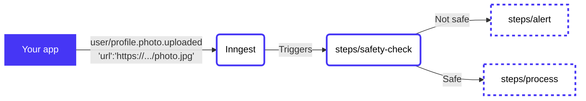

# Process images with Google Cloud and Sharp

<!-- Insert a short summary of the function. It should be no longer than a single paragraph -->
Respond to a `user/hello` event and output a `"Hello, [name]!"` message.

When a `user/profile.photo.uploaded` event is received, check that the uploaded image is safe using Google's Cloud Vision API, then process the images to create a variety of sizes.

<!-- Define a flowchart to visually show how the function will work -->
<!-- https://mermaid.live/ is a great tool for this, and docs are at https://mermaid-js.github.io/mermaid/#/flowchart -->


<!-- To go along with the visual diagram, you can optionally add some numbered steps here to show the same flow -->
<!-- This may not always be required or appropriate, e.g. if there are some async actions happening -->
1. `user/profile.photo.uploaded` event is received
2. ➡️ Run [steps/safety-check](steps/safety-check) to check image safety
3. If image **is** deemed safe:
   - ✅➡️ Run [steps/process](steps/process) to create different image sizes
4. If image **is not** deemed safe:
   - ⚠️➡️ Run [steps/alert](steps/alert) to warn that the user has uploaded something unsafe

## Contents

<!-- A table of contents for your example, covering a few key areas -->
- [Usage](#usage)
- [Configuration](#configuration)
- [Code](#code)
- [Triggering the function](#triggering-the-function)

## Usage

<!-- A quick view of how to get started with the template. -->
<!-- The CLI can guide them -->
Use this quickstart with a single CLI command to get started! The CLI will then guide you through running, testing, and deploying to [Inngest Cloud](https//inngest.com/sign-up?ref=github-example).

```sh
npx inngest-cli init --template github.com/inngest/inngest#examples/foo
```

Next, check out how to [👉 trigger the function](#triggering-the-function).

## Configuration

<!-- An annotated version of the `inngest.json|cue` file to help the user firm up the understanding of how the config works.-->

Below is the annotated function definition (found at [inngest.json](/inngest.json)) to show how the above is defined in config.

```json
{
  "name": "foo",
  "id": "foo",
  "triggers": [{
    /// When this event is received by Inngest, it will start the function
    "event": "...
  }]
}
```

## Code

This function has only a single step: `steps/hello`, which is triggered by the `user/hello` event.

<!-- A brief summary of where to find the various steps in the code and any other interesting configuration -->
- ➡️ [**steps/hello/**](/steps/hello)
  > Says hello and does the things and stuff.

## Triggering the function

<!-- Instructions for how the user should trigger the function from their infrastructure (or source) -->

Let's imagine a JavaScript application using the [Inngest JS SDK](https://github.com/inngest/inngest-js#readme).

In your `/signup` endpoint, you could add the following code:

```js
import { Inngest } from "inngest";

// POST myapp.com/signup
export default function signup(req, res) {
  const user = await createUser(req.body.email, req.body.password);

  // Send an event to Inngest
  // You can get a Source Key from the sources section of the Inngest app
  const inngest = new Inngest(process.env.INNGEST_SOURCE_API_KEY);
  await inngest.send({
    name: "app/user.signup",
    data: { city: req.body.city /* e.g. "Detroit" */ },
    user: {
      external_id: user.id,
      email: user.email,
    },
  });

  res.redirect("/app")
}
```
