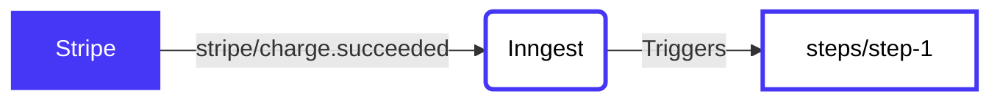

# Update your Prisma database from Stripe events

<!-- Insert a short summary of the function. It should be no longer than a single paragraph -->
Run a background job using the [Prisma ORM](https://www.prisma.io/) and [TypeScript](https://www.typescriptlang.org/) to create a new entry in the database when a webhook is received from [Stripe](https://stripe.com/).

➡️ Check out the related guide: [Running Prisma background jobs](https://www.inngest.com/docs/guides/prisma-background-jobs)

<!-- Define a flowchart to visually show how the function will work -->
<!-- https://mermaid.live/ is a great tool for this, and docs are at https://mermaid-js.github.io/mermaid/#/flowchart -->


1. Stripe sends `stripe/charge.succeeded` webhook
2. If the relevant user **is not found** in the database:
   - ⚠️ Return `404` and doesn't retry, allowing you to handle the edge case
3. If the relevant user **is found** in the database:
   - ✅ Create a new charge record

<!-- To go along with the visual diagram, you can optionally add some numbered steps here to show the same flow -->
<!-- This may not always be required or appropriate, e.g. if there are some async actions happening -->

## Contents

<!-- A table of contents for your example, covering a few key areas -->
- [Usage](#usage)
- [Configuration](#configuration)
- [Code](#code)
- [Triggering the function](#triggering-the-function)

## Usage

<!-- A quick view of how to get started with the template. -->
<!-- The CLI can guide them -->
Use this quickstart with a single CLI command to get started! The CLI will then guide you through running, testing, and deploying to [Inngest Cloud](https//inngest.com/sign-up?ref=github-example).

```sh
npx inngest-cli init --template github.com/inngest/inngest#examples/prisma-typescript-function
```

Next, check out how to [👉 trigger the function](#triggering-the-function).

## Configuration

<!-- An annotated version of the `inngest.json|cue` file to help the user firm up the understanding of how the config works.-->

Below is the annotated function definition (found at [inngest.json](/inngest.json)) to show how the above is defined in config.

```jsonc
{
  "name": "Prisma background job",
  "description": "Create a record in Prisma when a Stripe webhook is received.",
  "tags": ["typescript", "prisma", "stripe"],
  "id": "cute-troll-547a93",
  "triggers": [
    {
      /**
       * When this event is recieved by Inngest, it will start the function
       */
      "event": "stripe/charge.succeeded",
      "definition": {
        "format": "cue",
        "synced": true,

        /**
         * The file that declares the event schema that your app will send to
         * Inngest.
         */
        "def": "file://./events/stripe-charge-succeeded.cue"
      }
    }
  ],
  "steps": {
    "step-1": {
      /**
       * This step defines to "after" block, so will be run as soon as the
       * trigger above is received.
       */
      "id": "step-1",
      /**
       * This is the directory where your code will be, including its Dockerfile
       */
      "path": "file://./steps/step-1",
      "name": "Prisma background job",
      "runtime": {
        "type": "docker"
      }
    }
  }
}

```

## Code

This function has a single step: `steps/step-1`, which is triggered by the `stripe/charge.succeeded` event.

<!-- A brief summary of where to find the various steps in the code and any other interesting configuration -->
- ➡️ [**steps/step-1/**](/steps/step-1)
  > Finds the relevant user in the database and creates a new charge record if it could be found.

## Triggering the function

<!-- Instructions for how the user should trigger the function from their infrastructure (or source) -->

To receive Stripe events in your Inngest account, you can connect Stripe via OAuth. To do this, [create a new Source](https://app.inngest.com/sources/new#Stripe). This will link your Stripe and Inngest accounts so that we can automatically receive events as they happen.

Alternatively, you can send your own events from [your own apps](https://www.inngest.com/docs/sending-data-via-inngest-sdks) or [any webhook](https://www.inngest.com/docs/event-webhooks) and run any function automatically.
