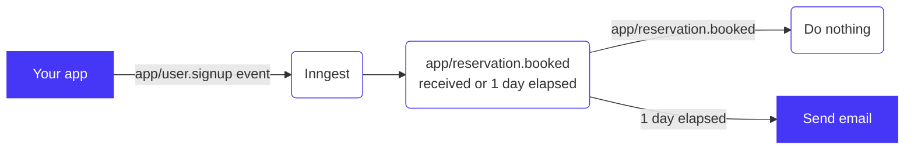

# Example Smart Drip Activation Email Campaign

This example Inngest function defines a drip campaign that sends a new user a **targeted**
email _if_ they have _not_ already performed the action that the email is suggesting they do.
Imagine this flow for an application:



1. User signed up
2. If the user _**has not**_ activated within 1 day:
   - ➡️ Send them an email to guide them to take that action
3. If the user _**has**_ activated:
   - 👍 Don't do anything - They already figured it out!

## Guide

- [Function configuration](#function-configuration)
- [Function code](#function-code)
- [Sending events from your app](#sending-events-from-your-app)
- [Deploying to Inngest Cloud](#deploying-to-inngest-cloud)

### Function configuration

The function definition is annotated to show how the above is defined in config:

1. After the `app/user.signup` event is received...
2. Wait up to 1 day (`1d`) for the user to activate (`app/reservation.booked`)...
3. If they have not triggered the activation event (`app/reservation.booked`)...
4. Send an email via Sendgrid

```json
{
  "name": "activation-drip-email",
  "id": "exciting-dogfish-63761d",
  "triggers": [
    {
      // When this event is received by Inngest, it will start the function
      "event": "app/user.signup",
      "definition": {
        "format": "cue",
        // The file that declares the event schema that your app will send to Inngest
        "def": "file://./events/app-user.signup.cue"
      }
    }
  ],
  "steps": {
    "step-1": {
      // This step will only be run "after" the below condition is true
      "id": "step-1",
      // This is the directory where your code will be including it's Dockerfile
      "path": "file://./steps/1d-send-email",
      "name": "activation-drip-email",
      "runtime": {
        "type": "docker"
      },
      // The "after" block lists conditions that will trigger the step to be run
      "after": [
        {
          // "$trigger" means this will happen directly after the above event
          // trigger: "app/user.signup"
          "step": "$trigger",
          // This is an asynchronous condition that will wait up to 1 day (1d)
          // for the "app/reservation.booked" asynchronous event to be received
          // The "match" checks that both events (the initial "event" and the
          // "async" event) contain the same user id ("external_id").
          "async": {
            "event": "app/reservation.booked",
            "match": "async.user.external_id == event.user.external_id",
            "ttl": "1d",
            "onTimeout": true
          }
        }
      ]
    }
  }
}
```

### Function code

All of the code for the function that sends the email to SendGrid, is
within the `steps/1d-send-email/src/index.ts` file. This code will be passed
the `app/user.signup` event if the 1 day timeout has been reached before
any `app/reservation.booked` email is received.

➡️ [Check out `index.ts`](/steps/1d-send-email/src/index.ts)

### Sending events from your app

Imagine a JavaScript application, using the [Inngest library](https://github.com/inngest/inngest-js#readme) in your `/signup` endpoint you can add the following code:

```js
import { Inngest } from "inngest";

// POST myapp.com/signup
export default function signup(req, res) {
  const user = await createUser(req.body.email, req.body.password);

  // Send an event to Inngest
  // You can get a Source Key from the sources section of the Inngest app
  const inngest = new Inngest(process.env.INNGEST_SOURCE_API_KEY);
  await inngest.send({
    name: "app/user.signup",
    data: { city: req.body.city /* e.g. "Detroit" */ },
    user: {
      external_id: user.id,
      email: user.email,
    },
  });

  res.redirect("/app")
}
```

And in your code that hands where the user is considered "activated", add the other event:

```js
import { Inngest } from "inngest";

// POST myapp.com/bookReservation
export default function bookReservation(req, res) {
  const user = await getUserFromSession(req)
  const reservation = await createReservation(user, req.body.restaurantId, req.body.timestamp);

  // Send an event to Inngest
  const inngest = new Inngest(process.env.INNGEST_SOURCE_API_KEY);
  await inngest.send({
    name: "app/reservation.booked",
    data: { restaurant: req.body.restaurantId },
    user: {
      external_id: user.id,
    },
  });

  res.redirect("/app")
}
```

### Deploying to Inngest Cloud

With an [Inngest Cloud account created](https://inngest.com/sign-up?ref=github-example-drip), use the Inngest CLI to deploy your function:

```
npm install -g inngest-cli
inngest login
inngest deploy
```

Done! Now send the events from your application and you'll see the events and function output in the Inngest web app.
