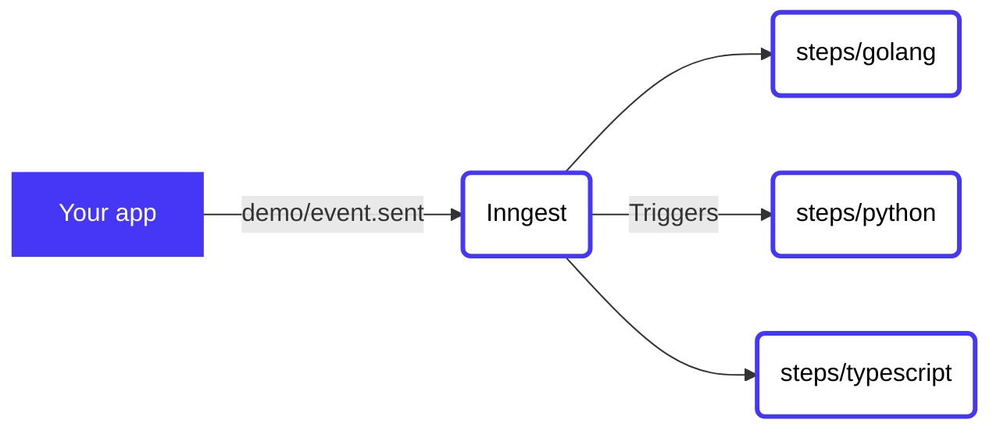

# Using environment variables

<!-- Insert a short summary of the function. It should be no longer than a single paragraph -->

A simple example of parsing and returning environment variables when running locally via `inngest run` in a few different languages.

<!-- Define a flowchart to visually show how the function will work -->
<!-- https://mermaid.live/ is a great tool for this, and docs are at https://mermaid-js.github.io/mermaid/#/flowchart -->



<!-- To go along with the visual diagram, you can optionally add some numbered steps here to show the same flow -->
<!-- This may not always be required or appropriate, e.g. if there are some async actions happening -->

## Contents

<!-- A table of contents for your example, covering a few key areas -->

- [Usage](#usage)
- [Configuration](#configuration)
- [Code](#code)
- [Triggering the function](#triggering-the-function)

## Usage

<!-- A quick view of how to get started with the template. -->
<!-- The CLI can guide them -->

Use this quickstart with a single CLI command to get started! The CLI will then guide you through running, testing, and deploying to [Inngest Cloud](https://inngest.com/sign-up?ref=github-example).

```sh
npx inngest-cli init --template github.com/inngest/inngest#examples/simple-env-vars
# or
inngest init --template github.com/inngest/inngest#examples/simple-env-vars
```

Next, just run your function locally to see how it consumes and returns the local `.env` file!

```sh
npx inngest-cli run
# or
inngest run
```

## Configuration

<!-- An annotated version of the `inngest.json|cue` file to help the user firm up the understanding of how the config works.-->

Below is the annotated function definition (found at [inngest.json](/inngest.json)) to show how the above is defined in config.

```jsonc
{
  "name": "simple-env-vars",
  "id": "direct-narwhal-196e41",
  "triggers": [
    {
      "event": "demo/event.sent",
      "definition": {
        "format": "cue",
        "synced": true,
        "def": "file://./events/demo-event-sent.cue"
      }
    }
  ],
  "steps": {
    /**
     * Our Golang example
     */
    "golang": {
      "id": "golang",
      "path": "file://steps/golang",
      "name": "golang",
      "runtime": {
        "type": "docker"
      }
    },
    /**
     * Our Python example
     */
    "python": {
      "id": "python",
      "path": "file://steps/python",
      "name": "python",
      "runtime": {
        "type": "docker"
      },
      "after": [
        {
          "step": "$trigger"
        }
      ]
    },
    /**
     * Our TypeScript example
     */
    "typescript": {
      "id": "typescript",
      "path": "file://steps/typescript",
      "name": "typescript",
      "runtime": {
        "type": "docker"
      },
      "after": [
        {
          "step": "$trigger"
        }
      ]
    }
  }
}
```

## Code

This function shows using env vars in three different languages: Golang, Python, and TypeScript. There's a separate step for each, triggered by the initial event, `demo/event.sent`.

<!-- A brief summary of where to find the various steps in the code and any other interesting configuration -->

- ➡️ [**steps/golang/**](steps/golang)
- ➡️ [**steps/python/**](steps/python)
- ➡️ [**steps/typescript/**](steps/typescript)
