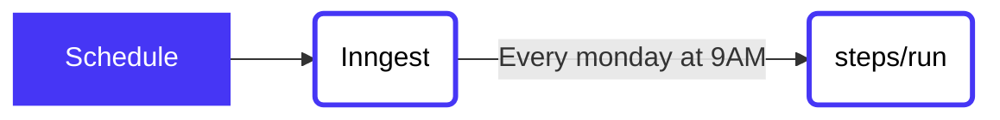

# Weekly summary & digest emails




1. Every Monday at 9AM (UTC), run our function
2. Within the first step, load all users then send their digest email

## Contents

- [Why](#why)
- [Usage](#usage)
- [Code](#code)


## Why

This solves writing scheduled functions without crons or queues in seconds with the following benefits:

1. Automatic retries for the entire scheduled function
2. Splitting each user's email into its own function, for retries, local timezone sending, and logging
3. Local testing without having to run on a schedule.

## Usage

<!-- A quick view of how to get started with the template. -->
<!-- The CLI can guide them -->
Use this quickstart with a single CLI command to get started! The CLI will then guide you through running, testing, and deploying to [Inngest Cloud](https//inngest.com/sign-up?ref=github-example).

Via the CLI:

```sh
inngest init --template github.com/inngest/inngest#examples/weekly-summary-email
```

Via NPX:
```sh
npx inngest-cli init --template github.com/inngest/inngest#examples/weekly-summary-email
```

With the function cloned, run `inngest run` to test the function locally.

## Code

This function has a single step within `steps/run`.  This step loads all summaries
to be sent, then sends an event to Inngest to record summary information and sends
the email.
