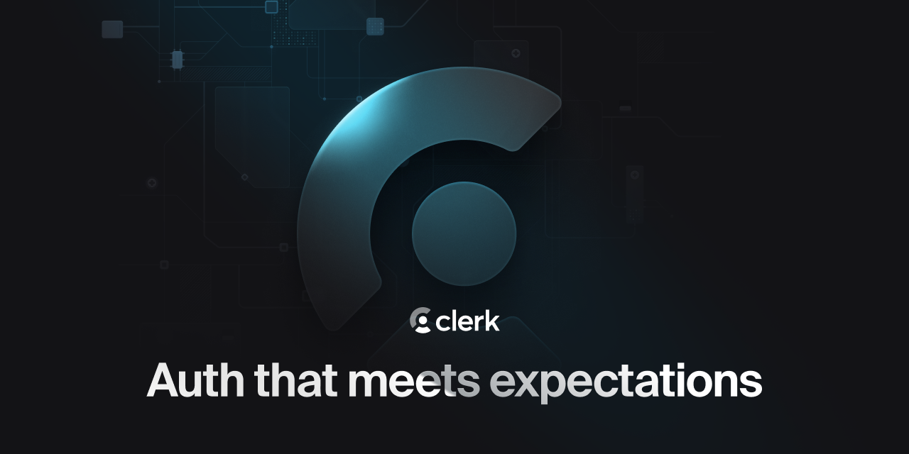

<p align="center">
  <a href="https://clerk.com?utm_source=DevRel&utm_medium=docs&utm_campaign=templates&utm_content=08-05-2023&utm_term=clerk-tanstack-start-quickstart" target="_blank" rel="noopener noreferrer">
    <picture>
      <source media="(prefers-color-scheme: dark)" srcset="./public/light-logo.png">
      
    </picture>
  </a>
  <br />
</p>
<div align="center">
  <h1>
    Clerk and TanStack Start Quickstart
  </h1>
  <a href="https://www.npmjs.com/package/@clerk/clerk-react">
    
  </a>
  <a href="https://discord.com/invite/b5rXHjAg7A">
    
  </a>
  <a href="https://twitter.com/clerkdev">
    
  </a>
  <br />
  <br />
  
</div>

## Introduction

Clerk is a developer-first authentication and user management solution. It provides pre-built components and hooks for sign-in, sign-up, user profile, and organization management. Clerk is designed to be easy to use and customize, and can be integrated into any TanStack Start application.

After following the [Clerk TanStack Start quickstart](https://clerk.com/docs/quickstarts/tanstack-start?utm_source=DevRel&utm_medium=docs&utm_campaign=templates&utm_content=08-05-2023&utm_term=clerk-tanstack-start-quickstart), you will have learned how to:

- Create a new TanStack Start application
- Install `@clerk/tanstack-react-start`
- Set up your environment keys
- Add `clerkMiddleware()` to your app
- Wrap your Root Component with `<ClerkProvider />`
- Use Clerk components to protect your content
- Embed the `<SignInButton />` and `<SignOutButton />`
- Deploy your application

## Running the template

```bash
git clone https://github.com/clerk/clerk-tanstack-start-quickstart
```

To run the example locally, you need to:

1. Sign up for a Clerk account at [https://clerk.com](https://www.clerk.com?utm_source=DevRel&utm_medium=docs&utm_campaign=templates&utm_content=08-05-2023&utm_term=clerk-tanstack-start-quickstart).

2. Go to the [Clerk dashboard](https://dashboard.clerk.com) and create an application.

3. Set the required Clerk environment variables as shown in [the example `env` file](./.env.example).

4. `npm install` the required dependencies.

5. `npm run dev` to launch the development server.

## Learn more

To learn more about Clerk and TanStack Start, check out the following resources:

- [Quickstart: Get started with TanStack Start and Clerk](https://clerk.com/docs/quickstarts/tanstack-start?utm_source=DevRel&utm_medium=docs&utm_campaign=templates&utm_content=08-05-2023&utm_term=clerk-tanstack-start-quickstart)
- [Clerk Documentation](https://clerk.com/docs?utm_source=DevRel&utm_medium=docs&utm_campaign=templates&utm_content=08-05-2023&utm_term=clerk-tanstack-start-quickstart)

## Found an issue or want to leave feedback

Feel free to create a support thread on our [Discord](https://clerk.com/discord). Our support team will be happy to assist you in the `#support` channel.

## Connect with us

You can discuss ideas, ask questions, and meet others from the community in our [Discord](https://discord.com/invite/b5rXHjAg7A).

If you prefer, you can also find support through our [Twitter](https://twitter.com/ClerkDev), or you can [email](mailto:support@clerk.dev) us!
